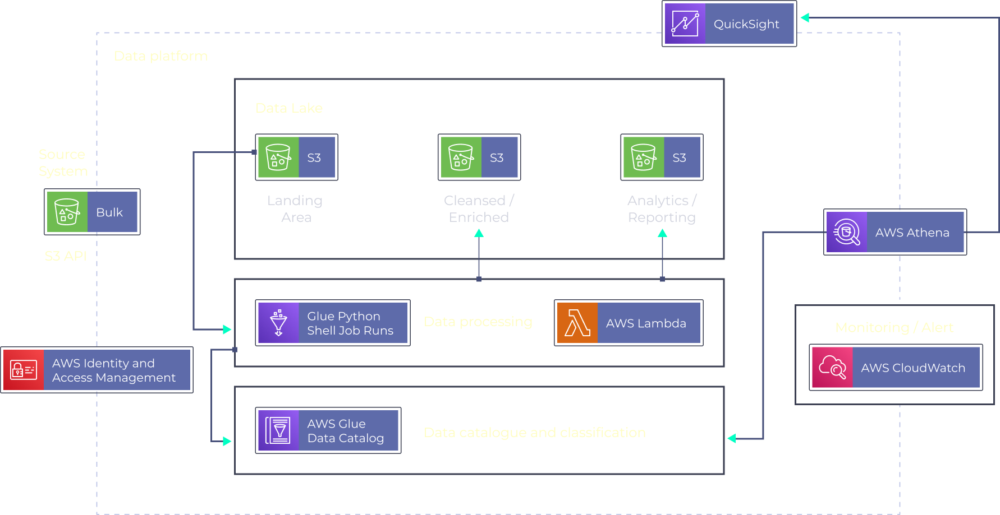

# YouTube_ETLPipeline

An ETL ML pipeline on YouTube data using Athena, Glue and Lambda
## Dataset Description
This Kaggle dataset contains statistics (CSV files) on daily popular YouTube videos over
the course of many months. There are up to 200 trending videos published every day
for many locations. The data for each region is in its own file. The video title, channel
title, publication time, tags, views, likes and dislikes, description, and comment count
are among the items included in the data. A category_id field, which differs by area, is
also included in the JSON file linked to the region.
## Tech Stack:
* Languages SQL, Python3
* Services AWS S3, AWS Glue, QuickSight, AWS Lambda, AWS Athena, AWS IAM
